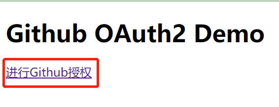
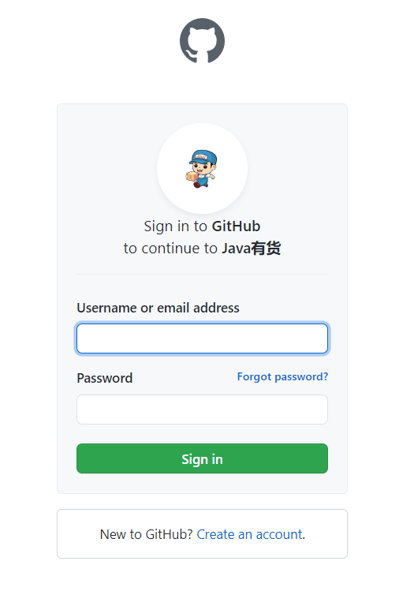

# Github OAuth Demo 

[详细的介绍](https://blog.csdn.net/weixin_38937840/article/details/113573841)
### 流程说明


- 注册github app [https://docs.github.com/en/developers/apps/creating-an-oauth-app](https://docs.github.com/en/developers/apps/creating-an-oauth-app)

- 更改 `templates\login.html` 下`client_id`的值

- 修改 `GithubAccessTokenController`
    
    ```java
       @GetMapping(value = "/access-token")
          public GithubUserInfo getToken(@RequestParam String code ,@RequestParam String state) throws JsonProcessingException {
              GithubAccessTokenDTO accessTokenDTO = new GithubAccessTokenDTO();
              accessTokenDTO.setClient_id("更换成自己的client_id");
              accessTokenDTO.setClient_secret("更换成自己的client_secret");
              accessTokenDTO.setCode(code);
              accessTokenDTO.setRedirect_uri("https://blog.csdn.net/weixin_38937840/article/details/105382447");
              accessTokenDTO.setState(state);
              //access_token=c2971568150c882deff55cce5a265955ad8a0524&scope=user&token_type=bearer
              //获取accessToken
              GithubAccessTokenBO accessToken = HttpClient.getAccessToken(accessTokenDTO);
              //获取用户信息
              GithubUserInfo user = HttpClient.getUser(accessToken.getAccess_token(),accessToken.getToken_type());
              return user;
          }
    ```
- 验证流程

    - 启动项目访问 [http://localhost:9006/login](http://localhost:9006/login)
      点击进行Github授权
    
    - 登录github
    
    - 截取回调路径的参数
    例如:`?code=225d6d342f1e34ba939e&state=1`
    - 请求 [localhost:9006/access-token?code=225d6d342f1e34ba939e&state=1](localhost:9006/access-token?code=225d6d342f1e34ba939e&state=1) 获取用户信息
    ```json
      {
          "id": 37392164,
          "login": "yanghaiji",
          "node_id": "",
          "avatar_url": "https://avatars.githubusercontent.com/u/37392164?v=4",
          "gravatar_id": "",
          "url": "https://api.github.com/users/yanghaiji",
          "html_url": "https://github.com/yanghaiji",
          "followers_url": "https://api.github.com/users/yanghaiji/followers",
          "following_url": "https://api.github.com/users/yanghaiji/following{/other_user}",
          "gists_url": "https://api.github.com/users/yanghaiji/gists{/gist_id}",
          "starred_url": "https://api.github.com/users/yanghaiji/starred{/owner}{/repo}",
          "subscriptions_url": "https://api.github.com/users/yanghaiji/subscriptions",
          "organizations_url": "https://api.github.com/users/yanghaiji/orgs",
          "repos_url": "https://api.github.com/users/yanghaiji/repos",
          "events_url": "https://api.github.com/users/yanghaiji/events{/privacy}",
          "received_events_url": "https://api.github.com/users/yanghaiji/received_events",
          "type": "User",
          "site_admin": false,
          "name": "杨海吉",
          "company": "Java有货",
          "blog": "yanghaij327@163.com",
          "location": "bei jing",
          "email": null,
          "hireable": null,
          "bio": "我为胜利而来，不向失败低头",
          "twitter_username": null,
          "public_repos": 30,
          "public_gists": 0,
          "followers": 16,
          "following": 0,
          "created_at": "2018-03-15T03:44:38Z",
          "updated_at": "2021-02-02T10:21:12Z",
          "private_gists": 2,
          "total_private_repos": 0,
          "owned_private_repos": 0,
          "disk_usage": 1387733,
          "collaborators": 0,
          "two_factor_authentication": false,
          "plan": {
              "name": "free",
              "space": 976562499,
              "collaborators": 0,
              "private_repos": 10000
          }
      }
    ```
这是一个标准的`oauth2`的授权码模式，关于demo上我问题大家可以提`issues`,或者添加微信`372787553` 带您进入程序员微信社区交流群
